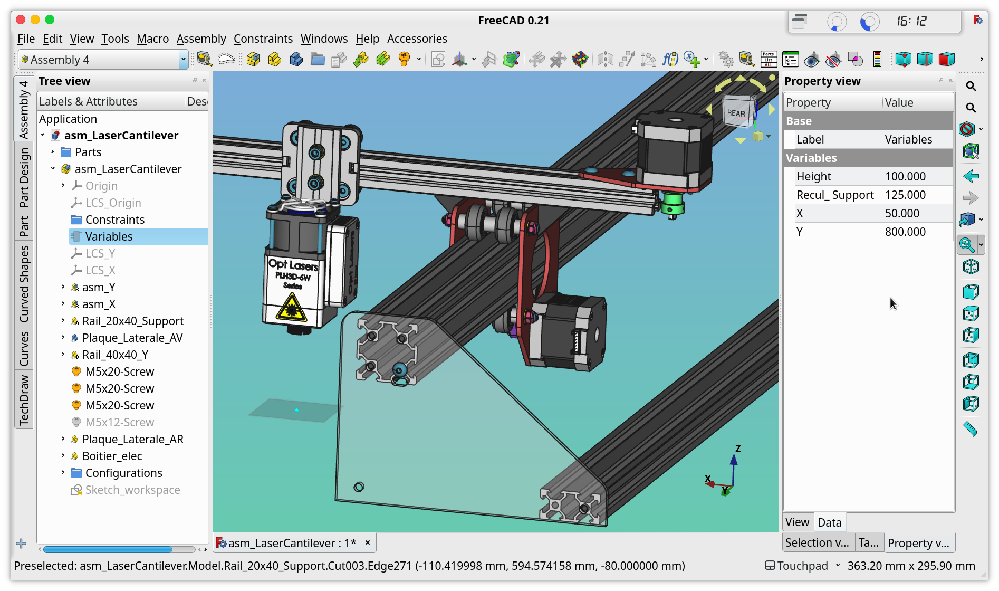

# Assembly4.1 Workbench for FreeCAD

> This workbench is based on the original [Assembly4](https://codeberg.org/Zolko/Assembly4) workbench and can be installed alongside it.

## Overview

This workbench allows you to combine FreeCAD objects into an assembly container and position them relative to the assembly and to each other. The parts in the assembly can either reside in the same document as the assembly or in an external document. When parts are modified in their original document, the changes are instantly reflected in the assembly.

The Assembly4 assembly is a standard FreeCAD `App::Part` container, so it is fully compatible with and can be manipulated using any FreeCAD tool that works with App::Part objects. In particular, it can be inserted into another Assembly to create nested assemblies at any level. It can also contain solids, datum objects, and sketches. 

A document can contain only one Assembly. Native FreeCAD Part and Body containers can be used as "parts" to be inserted. Since it is built on standard FreeCAD objects, all Assembly4 assemblies are fully compatible with standard FreeCAD tools.

Parts are positioned relative to each other by aligning features within them. In Assembly4, these features are virtual objects called LCS (Local Coordinate Systems, also known as datum coordinate systems) and are attached using FreeCAD's built-in Part::Attacher and ExpressionEngine. No geometry is used to position or constrain parts relative to each other, which helps avoid many topological naming issues. These built-in tools are fast, efficient, and stable, enabling the creation of very large assemblies with multiple levels of nested sub-assemblies.

**Note:** Only _Part_ and _Body_ containers at the root of a document can be inserted. Objects nested inside containers cannot be used directly in _Assembly4.1_.

## Installation

### Addon Manager (recommended)

_Assembly 4.1_ is available through the FreeCAD Addon Manager (menu **Tools > Addon Manager**).

## Getting Started

_Assembly 4.1_ uses extensively FreeCAD's built-in `Part::Attacher`, and you can find documentation [following this link](https://wiki.freecad.org/Part_EditAttachment). It is recommended to be familiar with this feature to get the best use out of this workbench.

## Documentation

* Start by reading the [User Manual](docs/USER_MANUAL.md), or
* See the more in-depth [Technical Manual](docs/TECH_MANUAL.md)
* Try the tutorial to create a [quick assembly from scratch](docs/Tutorial1/TUTORIAL_1.md)
* How to use a master sketch and animate assemblies by building a [cinematic assembly](docs/Tutorial1/TUTORIAL_2.md)
* For advanced users, you can learn how to use variant links with the [Theo Jansen sandwalker](docs/Tutorial1/TUTORIAL_3.md)

## Release notes

See the [CHANGELOG.md](CHANGELOG.md) file for release notes.

## License

_Assembly4.1_ is released under the open-source [LGPLv2.1](LICENSE) license.
